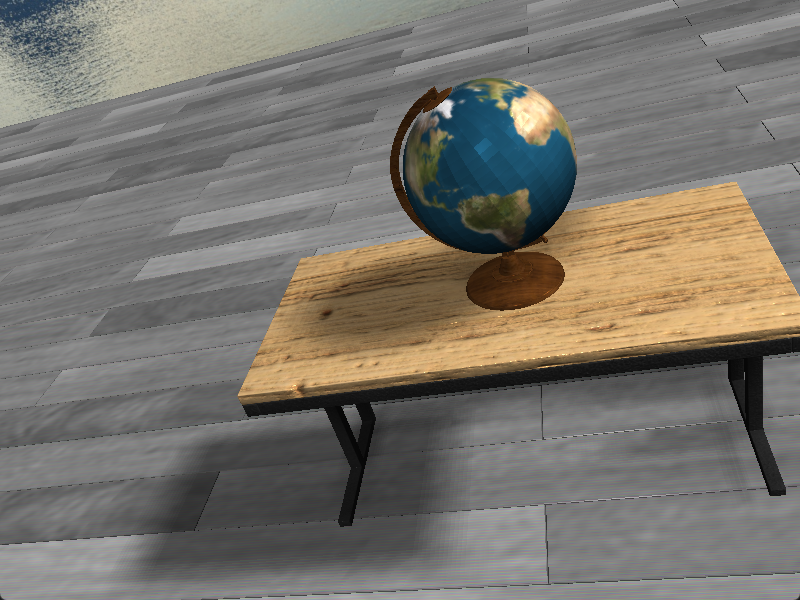
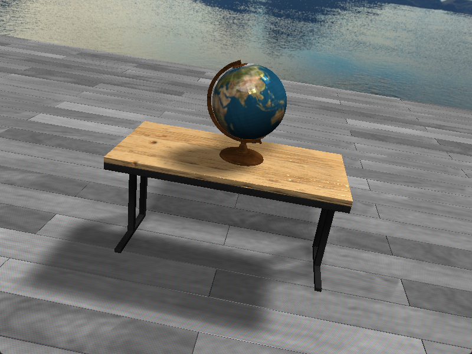

# Tellurion

**概述：** 

Tellurion 是一个基于 OpenGL 实现的地球仪渲染项目，旨在展示一些图形技术在实时3D渲染中的应用。项目集成了 Phong 光照模型、法线贴图、天空盒以及多种阴影映射技术（包括 SM、PCF、PCSS 和 VSM），提供光照和阴影效果。通过使用 Assimp 库进行模型导入，Tellurion 支持多种 3D 模型格式。此外，项目提供直观的操作指南，允许用户在 Windows 11 环境下轻松运行和构建项目，实现对摄像机和光源的实时控制。

**效果图：** 

# 实现的功能

- Phong光照模型：计算了模型的环境光、漫反射和镜面反射
- 模型导入：通过使用assimp库完成
- 法线贴图：通过assimp获取模型的切线和副切线数据计算切线空间，实现法线贴图
- 天空盒
- 阴影映射：包括SM、PCF、PCSS、VSM四种阴影映射技术

# 操作指南

**运行项目:**

- windows 11: 下载[release版本](https://github.com/1037827920/Tellurion/releases/tag/v1.0.0)解压缩后运行

- 移动摄像机：w、s、a、d

- 移动光源：上键、下键、左键、右键

**构建项目:**

> 这对于想要尝试不同阴影映射技术的效果以及修改代码的人来说，很有必要

1. 首先安装必要的环境，window11环境安装可以参考[这篇博客](https://1037827920.github.io/2024/10/31/Windows%E4%B8%8A%E5%A6%82%E4%BD%95%E4%BD%BF%E7%94%A8CMake%E6%9E%84%E5%BB%BA%E9%A1%B9%E7%9B%AE/)

2. 修改`CMakeLists.txt`文件，只需要修改vcpkg的集成的路径就行了，然后在vcpkg安装对应的包（需要注意包的平台跟编译环境一样，这个还是可以看上面那个博客）

3. 在vscode构建运行项目

**修改代码:**

- 修改阴影映射技术类型：修改`Scene.h`的`SHADOW_ALGORITHM`变量，具体含义代码注释又说
- 开启光线烘焙：需要注释掉`scene.yaml`中除了`gazebo.obj`的其他模型，然后将`Scene.h`中的`BAKE`设置为`ture`，在运行成功后按下空格开始光线烘焙（其他模型烘焙会失败，目前没有找到原因）

# 代码结构

- main.cpp: 入口函数
- utils: 
  - lightmapper.h: 光线烘焙的库，但是渲染模型贼慢（而且渲染一半会出现断言失败），提供了一个gazebo.obj来测试，但是效果不是很好（不知道问题在哪里
  - Mesh.h: 网格处理相关的函数
  - Model.h/Model.cpp: 模型处理的相关函数 （用来作为使用assimp库的适配器）
  - quaternionCamera.h: 四元组摄像机实现
  - Scene.h/Scene.cpp: 主渲染阶段/加载模型/阴影贴图生成/着色器初始化/光照贴图生成
  - shader.h：用来封装着色器的初始化、使用以及uniform变量的设置，方便开发
  - SkyBox.h/SkyBox.cpp: 天空盒的实现
  - WindowFactory.h/WindowFactroy.cpp: 使用工厂类设计模式封装opengl窗口初始化、上下文等操作，方便代码复用
- denpendencies:
  - assets: 模型数据
  - config: 场景布局，光照数据
  - shaders: 顶点/片段着色器源码
- CMakeLists: 构建项目的配置

# 参考

- Phong模型实现：https://learnopengl-cn.github.io/02%20Lighting/04%20Lighting%20maps/#_1
- assimp导入模型：https://learnopengl-cn.github.io/03%20Model%20Loading/03%20Model/
- 天空盒：https://learnopengl-cn.github.io/04%20Advanced%20OpenGL/06%20Cubemaps/
- 法线贴图：https://learnopengl-cn.github.io/05%20Advanced%20Lighting/04%20Normal%20Mapping/
- 阴影映射：
  - https://learnopengl-cn.github.io/05%20Advanced%20Lighting/03%20Shadows/01%20Shadow%20Mapping/
  - https://banbao991.github.io/2021/06/18/CG/Algorithm/SM-PCF-PCSS-VSM/#vsm-1
- 光线烘焙：https://github.com/ands/lightmapper?tab=readme-ov-file3